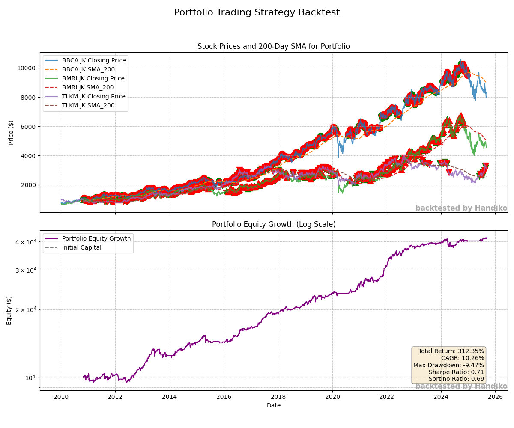

# Portfolio Trading Strategy Backtester
This Python script implements and backtests a multi-asset trading strategy on a portfolio of up to five different stock tickers. It leverages common technical indicators to generate buy and sell signals and simulates portfolio performance over historical data.

---

## Core Functionality
* Multi-Asset Backtesting: The script is designed to handle a portfolio of 1 to 5 user-defined ticker symbols. It concurrently downloads, processes, and backtests the strategy on each asset, aggregating the results to track the total portfolio equity.
* Indicator-Based Signals: The trading logic is built on a dual-indicator system:
  * 200-Day Simple Moving Average (SMA): The script calculates the 200-day SMA, a long-term trend-following indicator. A buy signal is generated only when the closing price of the asset is above this moving average, confirming an uptrend.
  * 2-Period Relative Strength Index (RSI): The 2-period RSI, a momentum oscillator, is used to identify short-term overbought or oversold conditions. A buy signal is triggered when the RSI falls below a threshold of 10, indicating that the asset may be oversold.
* Trading Logic:
  * Buy Signal: A position is initiated when both the closing price is greater than the 200-day SMA and the 2-period RSI is less than 10. The script allocates an equal portion of the initial capital to each ticker.
  * Sell Signal: A position is exited when the current day's closing price exceeds the previous day's high, indicating a strong upward move that could be a temporary spike.
* Data Handling: The yfinance library is used for downloading historical stock data from Yahoo Finance. The script gracefully handles tickers for which no data is available and aligns the backtesting period across all assets to ensure a consistent simulation.
* Performance Visualization:
  * A two-pane matplotlib plot is generated to visualize the backtesting results.
  * The top pane displays the closing prices and 200-day SMA for each ticker, with distinct markers for buy and sell signals.
  * The bottom pane shows the cumulative portfolio equity growth on a logarithmic scale, making it easier to visualize percentage changes over time.

## Technical Breakdown
The backtesting engine operates on a synchronized timeline, ensuring all tickers in the portfolio are evaluated on the same dates. This is achieved by first creating a consolidated, unique, and sorted list of all trading dates across all downloaded datasets using pd.concat(). A minimum start date for the backtest is then determined as the date after which the 200-day SMA is available for all tickers, preventing data look-back errors.

The core of the simulation is a for loop that iterates through this master list of dates. For each day, the script uses a dictionary (portfolio_state) to maintain the independent state of each ticker (e.g., in_position, shares, cash, entry_dates, exit_dates). This allows the trading logic to be applied individually to each asset, making autonomous buy/sell decisions based on its own data. The portfolio's total value is then calculated by summing the cash and current market value of all holdings on that day.

For performance visualization, itertools.cycle is used to efficiently assign a different marker style and color to the buy/sell signals of each ticker, enhancing the readability of the multi-asset plot without requiring manual assignment.

## Installation & Usage
Clone the repository:
```bash
    git clone https://github.com/your-username/your-repo-name.git
```

Navigate to the directory:
```bash
    cd your-repo-name
```

Install the required libraries:
```bash
    pip install -r requirements.txt (assuming a requirements.txt file exists) or manually:
    pip install yfinance pandas matplotlib numpy
```

Modify the ticker_symbols list in main() to your desired tickers.
Run the script:
```bash
    python your_script_name.py
```

Code: [here](https://github.com/handiko/RSI-2-Portfolio-Trading-Strategy-Backtester/blob/main/JupyterNotebook/Portfolio%20Mode%20-%202-RSI%20Trading%20Strategy.ipynb)

## Example
Backtesting 3 Indonesian stocks (BBCA, BMRI, and TLKM)



---

## Disclaimer!!
This repository is intended for educational purposes only and does not constitute financial advice. Past performance is not indicative of future results.

---

## Related Project
[RSI-2 Stock Strading Strategy](https://github.com/handiko/RSI-2-Stock-Trading-Strategy/blob/main/README.md)
